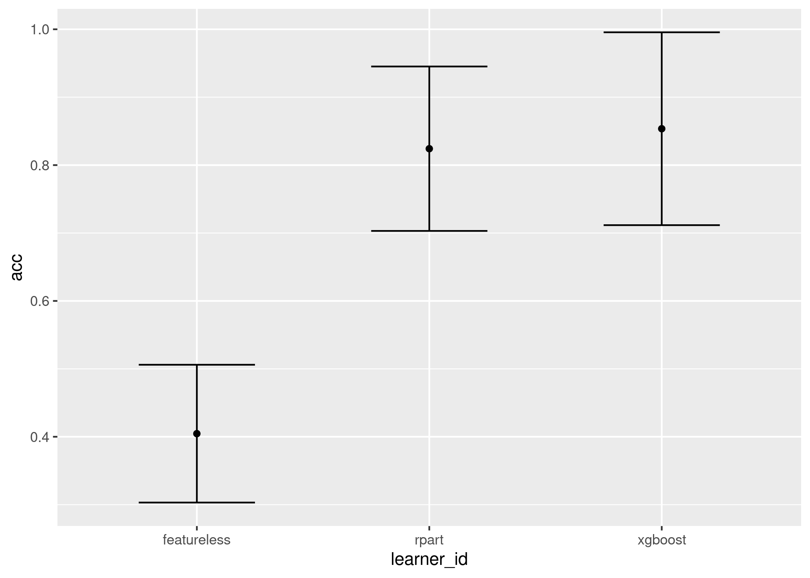

# mlr3benchmark

Analysis and tools for benchmarking in
[mlr3](https://github.com/mlr-org/mlr3).

<!-- badges: start -->

[](https://github.com/mlr-org/mlr3benchmark/actions)
[](https://cran.r-project.org/package=mlr3benchmark)

[](https://stackoverflow.com/questions/tagged/mlr3)
[](https://lmmisld-lmu-stats-slds.srv.mwn.de/mlr_invite/)
<!-- badges: end -->

## What is mlr3benchmark?

Do you have a large benchmark experiment with many tasks, learners, and
measures, and don’t know where to begin with analysis? Do you want to
perform a complete quantitative analysis of benchmark results to
determine which learner truly is the ‘best’? Do you want to visualise
complex results for benchmark experiments in one line of code?

Then **mlr3benchmark** is the answer, or at least will be once it’s
finished maturing.

**mlr3benchmark** enables fast and efficient analysis of benchmark
experiments in just a few lines of code. As long as you can coerce your
results into a format fitting our classes (which have very few
requirements), then you can perform your benchmark analysis with
**mlr3benchmark**.

## Installation

Install the last release from CRAN:

``` r
install.packages("mlr3benchmark")
```

Install the development version from GitHub:

``` r
remotes::install_github("mlr-org/mlr3benchmark")
```

## Feature Overview

Currently **mlr3benchmark** only supports analysis of multiple learners
over multiple tasks. The current implemented features are best
demonstrated by example\!

First we run a mlr3 benchmark experiment:

``` r
library(mlr3)
library(mlr3learners)
library(ggplot2)
set.seed(1)

task = tsks(c("iris", "sonar", "wine", "zoo"))
learns = lrns(c("classif.featureless", "classif.rpart", "classif.xgboost"))
bm = benchmark(benchmark_grid(task, learns, rsmp("cv", folds = 3)))
```

Now we create a `BenchmarkAggr` object for our analysis, these objects
store measure results after being *aggregated* over all resamplings:

``` r
# these measures are the same but we'll continue for the example
ba = as.BenchmarkAggr(bm, measures = msrs(c("classif.acc", "classif.ce")))
ba
```

    ## <BenchmarkAggr> of 12 rows with 4 tasks, 3 learners and 2 measures
    ##     task_id  learner_id       acc         ce
    ##      <fctr>      <fctr>     <num>      <num>
    ##  1:    iris featureless 0.2800000 0.72000000
    ##  2:    iris       rpart 0.9466667 0.05333333
    ##  3:    iris     xgboost 0.9600000 0.04000000
    ##  4:   sonar featureless 0.5334023 0.46659765
    ##  5:   sonar       rpart 0.6537612 0.34623879
    ##  6:   sonar     xgboost 0.6394755 0.36052450
    ##  7:    wine featureless 0.3990584 0.60094162
    ##  8:    wine       rpart 0.8652542 0.13474576
    ##  9:    wine     xgboost 0.9048023 0.09519774
    ## 10:     zoo featureless 0.4058229 0.59417706
    ## 11:     zoo       rpart 0.8309566 0.16904337
    ## 12:     zoo     xgboost 0.9099822 0.09001783

Now we can begin our analysis\! In **mlr3benchmark**, analysis of
multiple learners over multiple independent tasks follows the guidelines
of Demsar (2006). So we begin by checking if the global Friedman test is
significant: is there are a significant difference in the rankings of
the learners over all the tasks?

``` r
ba$friedman_test()
```

    ##      X2 df    p.value p.signif
    ## acc 6.5  2 0.03877421        *
    ## ce  6.5  2 0.03877421        *

Both measures are significant, so now we can proceed with the post-hoc
tests. Now comparing each learner to each other with post-hoc
Friedman-Nemenyi tests:

``` r
ba$friedman_posthoc(meas = "acc")
```

    ## 
    ##  Pairwise comparisons using Nemenyi-Wilcoxon-Wilcox all-pairs test for a two-way balanced complete block design

    ## data: acc and learner_id and task_id

    ##         featureless rpart
    ## rpart   0.181       -    
    ## xgboost 0.036       0.759

    ## 
    ## P value adjustment method: single-step

The results tell us that xgboost is significantly different from the
featureless model, but all other comparisons are non-significant. This
doesn’t tell us *which* of xgboost and featureless is better though, the
most detailed information is given in a critical difference diagram,
note we include `minimize = FALSE` as accuracy should be maximised:

``` r
autoplot(ba, type = "cd", meas = "acc", minimize = FALSE)
```

<!-- -->

We read the diagram from left to right, so that learners to the left
have the highest rank and are the best performing, and decrease going
right. The thick horizontal lines connect learners that are *not*
significantly difference in ranked performance, so this tells us:

1.  xgboost is significantly better than featureless
2.  xgboost is not significantly better than rpart
3.  rpart is not significantly better than featureless

Now we visualise two much simpler plots which display similar
information, the first is the mean and standard error of the results
across all tasks, the second is a boxplot across all tasks:

``` r
autoplot(ba, meas = "acc")
```

<!-- -->

``` r
autoplot(ba, type = "box", meas = "acc")
```

<!-- -->

We conclude that xgboost is significantly better than the baseline but
not significantly better than the decision tree but the decision tree is
not significantly better than the baseline, so we will recommend xgboost
for now.

The analysis is complete\!

## Roadmap

**mlr3benchmark** is in its early stages and the interface is still
maturing, near-future updates will include:

  - Extending `BenchmarkAggr` to non-independent tasks
  - Extending `BenchmarkAggr` to single tasks
  - Adding `BenchmarkScore` for non-aggregated measures,
    e.g. observation-level scores
  - Bayesian methods for analysis

## Bugs, Questions, Feedback

**mlr3benchmark** is a free and open source software project that
encourages participation and feedback. If you have any issues,
questions, suggestions or feedback, please do not hesitate to open an
“issue” about it on the [GitHub
page](https://github.com/mlr-org/mlr3benchmark/issues)\! In case of
problems / bugs, it is often helpful if you provide a “minimum working
example” that showcases the behaviour (but don’t worry about this if the
bug is obvious).
